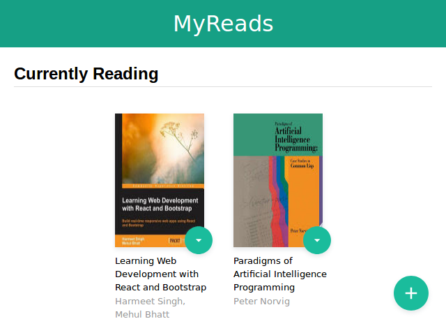

# MyReads

[](https://github.com/feross/standard)

>MyReads is a bookshelf app that allows you to select and categorize books you have read, are currently reading, or want to read. This project was developed as a part of [React Nanodegree](https://www.udacity.com/course/react-nanodegree--nd019)

## Installation

> We  assume that you have `yarn` or `npm` installed on your machine.

Clone the project:
```bash
git clone git@github.com:hiseni/my-reads.git
```

Install necessary dependencies`*`:
```bash
yarn install
```

Run the app`*`:
```bash
yarn start
```

## Searching for books

Searching is currently limited to `20` books per search as well as these keywords:
```javascript
'Android', 'Art', 'Artificial Intelligence', 'Astronomy', 'Austen', 'Baseball', 'Basketball', 'Bhagat', 'Biography', 'Brief', 'Business', 'Camus', 'Cervantes', 'Christie', 'Classics', 'Comics', 'Cook', 'Cricket', 'Cycling', 'Desai', 'Design', 'Development', 'Digital Marketing', 'Drama', 'Drawing', 'Dumas', 'Education', 'Everything', 'Fantasy', 'Film', 'Finance', 'First', 'Fitness', 'Football', 'Future', 'Games', 'Gandhi', 'Homer', 'Horror', 'Hugo', 'Ibsen', 'Journey', 'Kafka', 'King', 'Lahiri', 'Larsson', 'Learn', 'Literary Fiction', 'Make', 'Manage', 'Marquez', 'Money', 'Mystery', 'Negotiate', 'Painting', 'Philosophy', 'Photography', 'Poetry', 'Production', 'Programming', 'React', 'Redux', 'River', 'Robotics', 'Rowling', 'Satire', 'Science Fiction', 'Shakespeare', 'Singh', 'Swimming', 'Tale', 'Thrun', 'Time', 'Tolstoy', 'Travel', 'Ultimate', 'Virtual Reality', 'Web Development', 'iOS'
```

## Code style and linting

This project didn't fully following [Udacity Frontend Nanodegree Style Guide](http://udacity.github.io/frontend-nanodegree-styleguide/javascript.html) favoring simplicity and [JavaScript Standard Style](https://standardjs.com) instead.

You can lint the project with`*`:
```bash
yarn lint
```

> `*` You can use `npm` here as well

## Contributing
All sorts of contributions are warmly welcomed. There is no special restricted form for those willing to contribute to this project. You can start contributing by [filing an issue](https://github.com/hiseni/my-reads/issues/new).

## Screenshots



## License

[MIT](LICENSE.md)
